# Auth0 OAuth 2.0 Authorization Code Flow

```mermaid
sequenceDiagram
    participant User
    participant CLI as CMMC Scout CLI
    participant Browser
    participant Auth0
    participant Callback as Local Server :8765
    participant DB as PostgreSQL

    User->>CLI: Run demo
    CLI->>CLI: Generate CSRF state token
    CLI->>Browser: Open Auth0 login URL
    Browser->>Auth0: GET /authorize?response_type=code
    Auth0->>User: Show login page
    User->>Auth0: Enter credentials
    Auth0->>Auth0: Validate user
    Auth0->>Browser: Redirect to callback with code
    Browser->>Callback: GET /callback?code=xxx&state=yyy
    Callback->>Callback: Verify CSRF state
    Callback->>Auth0: POST /oauth/token (exchange code)
    Auth0->>Callback: Return access_token
    Callback->>Auth0: GET /userinfo (with Bearer token)
    Auth0->>Callback: Return user profile
    Callback->>DB: Create/update user record
    DB->>Callback: User stored
    Callback->>CLI: Return user_info + token
    CLI->>User: ✓ Authenticated as user@email.com
```

## Key Security Features

- **CSRF Protection**: State parameter validates callback authenticity
- **Local Callback Server**: Runs on localhost:8765 to receive authorization code
- **Token Exchange**: Authorization code exchanged server-side for access token
- **Multi-Tenant**: User profiles stored in database with role-based access
- **Standard OAuth 2.0**: Full compliance with authorization code flow spec
