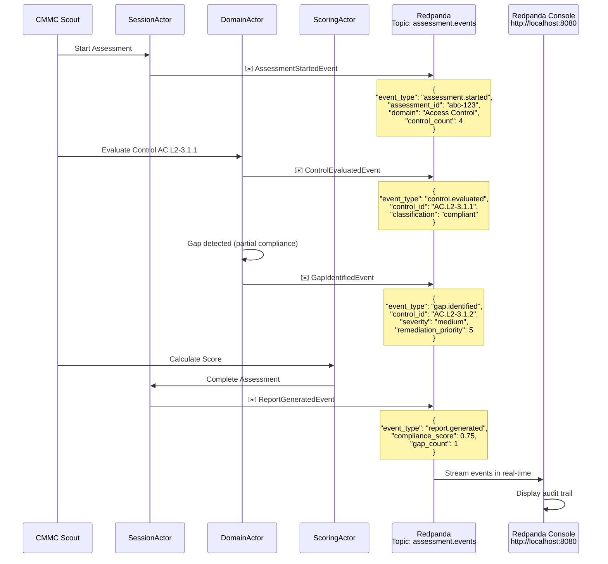

# Redpanda Event Streaming - Compliance Audit Trail

## Event Types Emitted

| Event Type | Emitted By | Purpose |
|------------|-----------|---------|
| `assessment.started` | SessionActor | Track when assessments begin |
| `control.evaluated` | DomainActor | Log each control's classification |
| `gap.identified` | DomainActor | Flag non-compliant controls |
| `report.generated` | SessionActor | Record final compliance score |

## Kafka-Compatible Features

- **Topic**: `assessment.events`
- **Partitioning**: By assessment_id for event ordering
- **Retention**: 7 days (configurable)
- **Consumer Groups**: SIEM tools can subscribe
- **Schema Registry**: Available on port 18081
- **Console UI**: http://localhost:8080 for real-time monitoring

## SIEM Integration Ready

Events are JSON-formatted and can be consumed by:
- Splunk via Kafka Connect
- Elasticsearch for log aggregation
- DataDog for security monitoring
- Custom compliance dashboards
