# CMMC Scout Architecture

## System Overview with 5 Vendor Integrations

```mermaid
graph TB
    subgraph "User Interface"
        User[👤 Defense Contractor User]
        Browser[🌐 Web Browser/CLI]
    end

    subgraph "CMMC Scout Application"
        API[FastAPI Application<br/>main.py]
        Auth[Auth Middleware<br/>auth0_client.py]
        Agent[LangGraph Agent<br/>assessment_agent.py]

        subgraph "Akka Actor System (Pykka)"
            SessionActor[🎭 SessionActor<br/>User Session State]
            DomainActor[🎭 DomainActor<br/>Control Evaluation]
            ScoringActor[🎭 ScoringActor<br/>Compliance Scoring]
        end

        DB[(PostgreSQL<br/>Assessment Data)]
        Reports[Report Service<br/>Gap Reports]
    end

    subgraph "Vendor Integrations"
        subgraph "1️⃣ Auth0"
            Auth0[🔐 Auth0<br/>OAuth 2.0 + RBAC]
        end

        subgraph "2️⃣ Anthropic"
            Claude[🤖 Claude Haiku<br/>Question Generation<br/>Response Classification]
        end

        subgraph "3️⃣ Comet ML"
            Comet[📊 Comet ML<br/>LLM Observability<br/>Experiment Tracking]
        end

        subgraph "4️⃣ Redpanda"
            Redpanda[📡 Redpanda<br/>Event Streaming<br/>Audit Trail]
        end

        subgraph "5️⃣ Akka"
            Note[🎭 Already shown above<br/>Actor-based concurrency]
        end
    end

    %% User Flow
    User -->|1. Login| Browser
    Browser -->|2. OAuth Flow| Auth0
    Auth0 -->|3. JWT Token| Auth
    Auth -->|4. Authenticated Request| API

    %% Assessment Flow
    API -->|5. Start Assessment| SessionActor
    SessionActor -->|6. Initialize Domain| DomainActor
    DomainActor -->|7. Generate Question| Agent
    Agent -->|8. LLM API Call| Claude
    Claude -->|9. AI-Generated Question| Agent
    Agent -->|10. Log Prompt/Response| Comet

    %% User Response Flow
    Browser -->|11. User Answer| API
    API -->|12. Evaluate Response| DomainActor
    DomainActor -->|13. Classify Answer| Agent
    Agent -->|14. LLM Classification| Claude
    Claude -->|15. Compliant/Partial/Non-Compliant| Agent
    Agent -->|16. Log Classification| Comet

    %% Event & Scoring Flow
    DomainActor -->|17. Emit Event| Redpanda
    Redpanda -->|18. control.evaluated| Redpanda
    DomainActor -->|19. Send Score| ScoringActor
    ScoringActor -->|20. Calculate Compliance %| ScoringActor
    ScoringActor -->|21. Red/Yellow/Green Status| SessionActor
    SessionActor -->|22. Emit Event| Redpanda
    Redpanda -->|23. assessment.completed| Redpanda

    %% Report Generation
    SessionActor -->|24. Request Report| Reports
    Reports -->|25. Query Assessment Data| DB
    DB -->|26. Control Responses| Reports
    Reports -->|27. Generate Gap Report| Browser

    %% Data Persistence
    SessionActor -.->|Save State| DB
    DomainActor -.->|Save Responses| DB
    ScoringActor -.->|Save Scores| DB

    %% Styling
    classDef vendor fill:#8b5cf6,stroke:#6d28d9,stroke-width:3px,color:#fff
    classDef actor fill:#10b981,stroke:#059669,stroke-width:2px,color:#fff
    classDef app fill:#3b82f6,stroke:#2563eb,stroke-width:2px,color:#fff

    class Auth0,Claude,Comet,Redpanda,Note vendor
    class SessionActor,DomainActor,ScoringActor actor
    class API,Auth,Agent,Reports app
```



## Event Flow Detail


## Vendor Integration Details

### 1️⃣ Auth0 - Authentication & Authorization
- **Purpose**: Enterprise OAuth 2.0 authentication with RBAC
- **Implementation**: Authorization code flow with PKCE
- **Features**:
  - Browser-based login with callback server (port 8765)
  - JWT token validation
  - Role-based access control (assessor, client, admin)
  - CSRF protection

### 2️⃣ Anthropic Claude Haiku - AI Assessment Engine
- **Purpose**: Generate questions and classify responses
- **Implementation**: LangChain + Anthropic API
- **Features**:
  - Context-aware question generation for NIST 800-171 controls
  - Intelligent response classification (compliant/partial/non-compliant)
  - Reasoning transparency for audit trails

### 3️⃣ Comet ML - LLM Observability
- **Purpose**: Track all LLM decisions and metrics
- **Implementation**: Comet Experiment API
- **Features**:
  - Log every prompt and response
  - Track classification confidence scores
  - Record assessment duration and token usage
  - Dashboard for compliance auditing

### 4️⃣ Redpanda - Event Streaming
- **Purpose**: Compliance audit trail and event-driven architecture
- **Implementation**: Kafka-compatible producer/consumer
- **Features**:
  - Real-time event streaming
  - Topics: `assessment.started`, `control.evaluated`, `gap.identified`, `report.generated`
  - SIEM-ready event format
  - Immutable audit log

### 5️⃣ Akka (Pykka) - Actor System
- **Purpose**: Stateful, concurrent session management
- **Implementation**: Pykka (Python Akka)
- **Features**:
  - **SessionActor**: Manages user assessment lifecycle
  - **DomainActor**: Handles control evaluation per domain
  - **ScoringActor**: Calculates compliance scores with traffic light status
  - Fault tolerance and supervision

## Data Flow Summary

1. **User authenticates** via Auth0 OAuth 2.0
2. **SessionActor spawned** for assessment session
3. **DomainActor evaluates controls** one by one
4. **Claude Haiku generates questions** and classifies responses
5. **Comet ML logs** every LLM interaction
6. **Redpanda streams events** for audit trail
7. **ScoringActor calculates** compliance percentage
8. **Gap report generated** with remediation steps

## Scoring Algorithm

```python
# Implemented in ScoringActor
compliant_score = 1.0
partial_score = 0.5
non_compliant_score = 0.0

total_score = sum([
    1.0 if classification == "compliant" else
    0.5 if classification == "partial" else
    0.0
    for classification in control_responses
])

compliance_percentage = (total_score / total_controls) * 100

# Traffic Light Status
if compliance_percentage >= 80:
    status = "GREEN"  # Ready for CMMC assessment
elif compliance_percentage >= 50:
    status = "YELLOW"  # Some gaps, needs work
else:
    status = "RED"  # Major gaps, significant remediation needed
```

## Technology Stack

- **Backend**: Python 3.11, FastAPI, LangGraph, Pykka
- **Database**: PostgreSQL
- **Event Streaming**: Redpanda (Kafka-compatible)
- **Authentication**: Auth0 OAuth 2.0
- **LLM**: Anthropic Claude Haiku via LangChain
- **Observability**: Comet ML
- **Actor System**: Pykka (Python Akka implementation)

## Hackathon Impact

**Total Vendor Integrations**: 5
**Bonus Points**: +40 (8 points per integration)
**Base Score**: 100
**Maximum Possible Score**: 140

This architecture demonstrates production-ready patterns for:
- Secure authentication
- AI-powered compliance assessment
- Complete audit trail
- Scalable actor-based concurrency
- Full LLM observability
